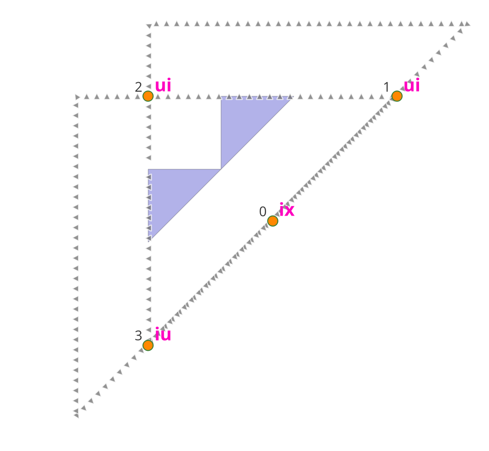
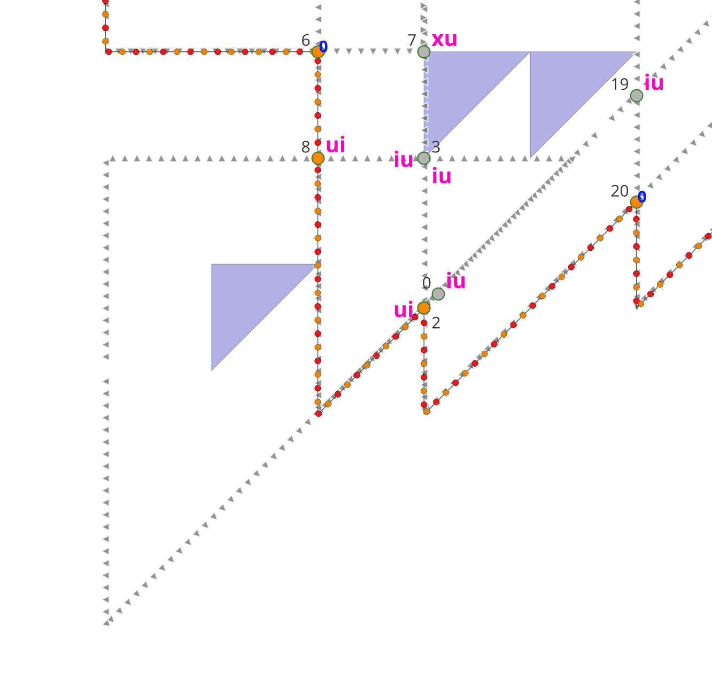
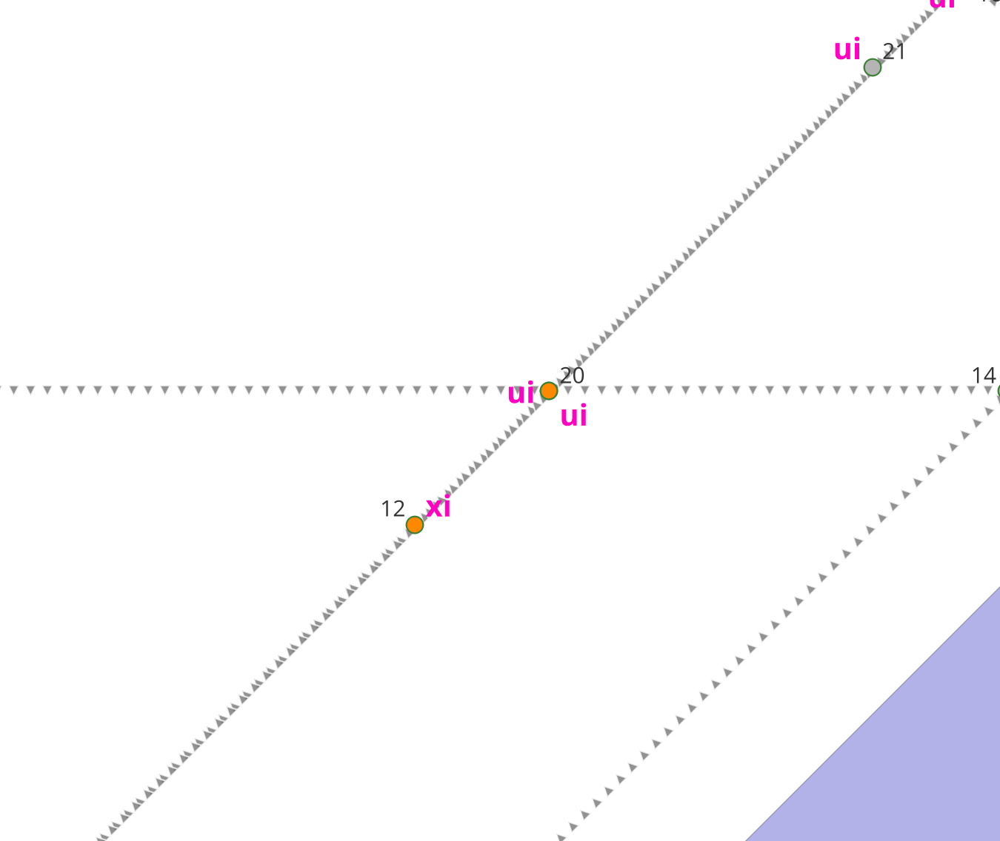
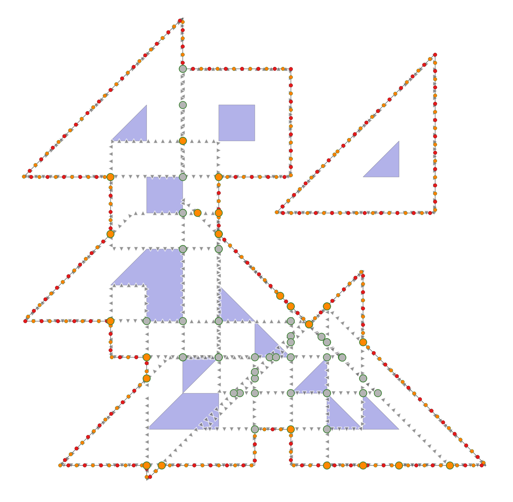
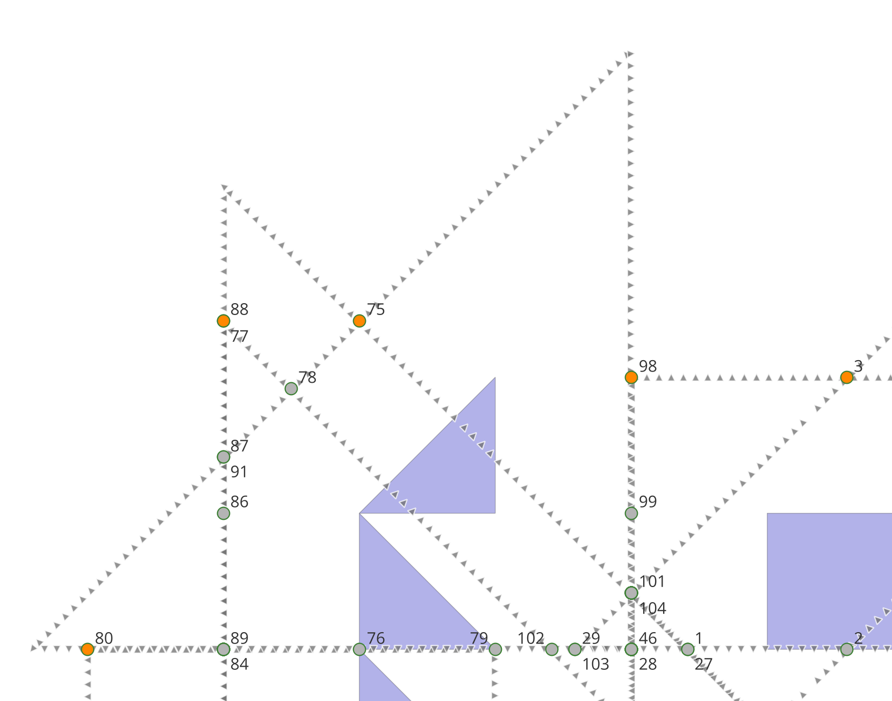
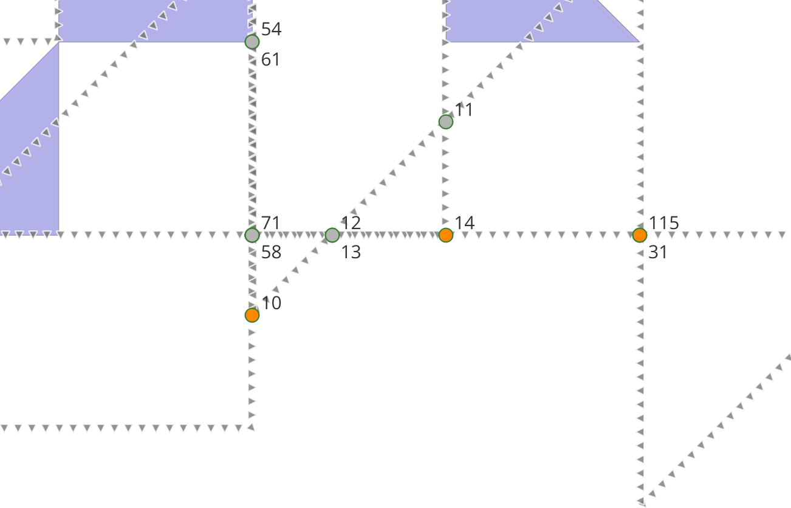
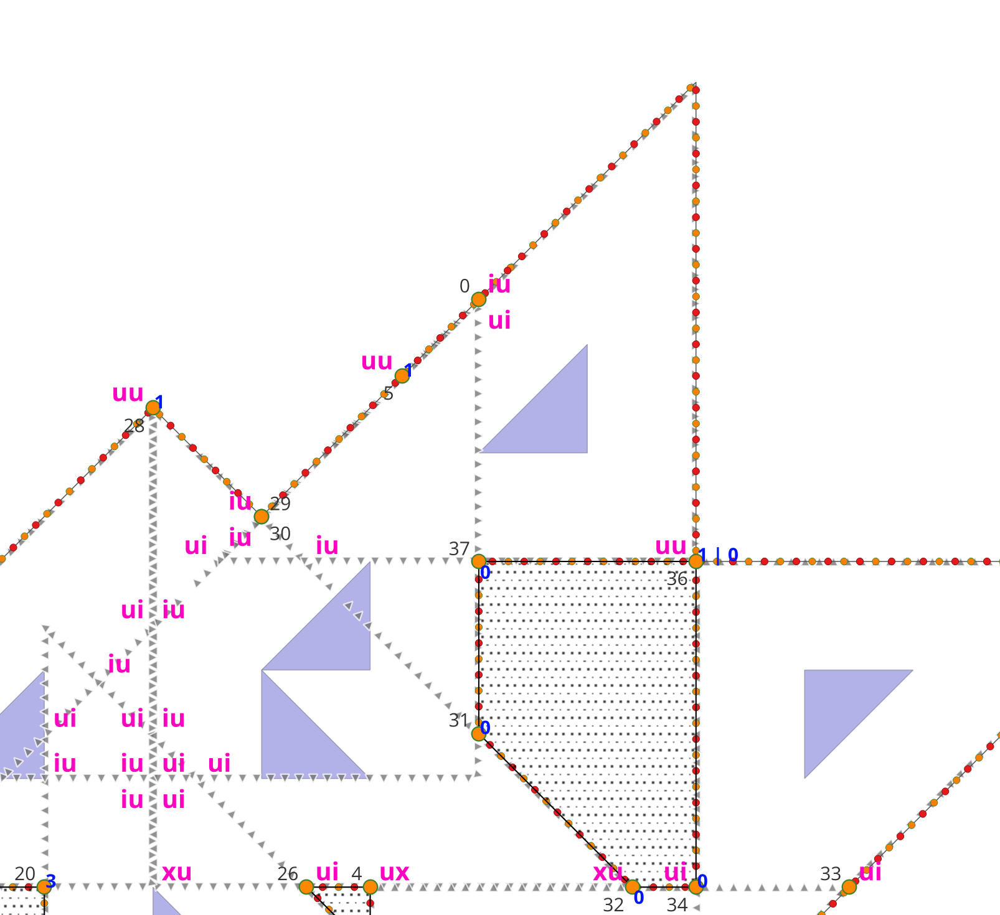
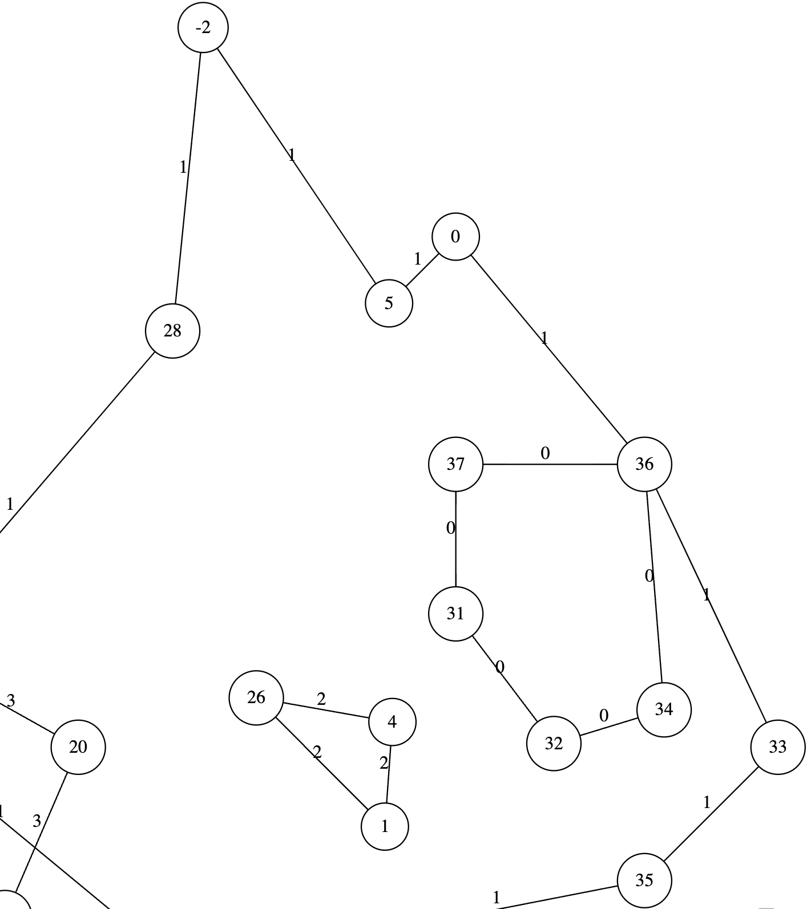
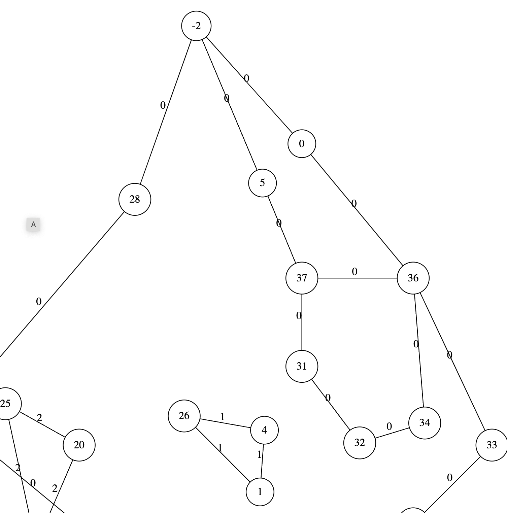

# Buffer cases

## Recursive Polygons Buffer

### rt_w series

#### rt_w1

#### rt_w2

This case failed because of a generated `x` (block) in `get_turn_info.hpp`
It is fixed by removing them `ix` etc.

#### rt_w3

This case failed because it selected the wrong `u` turn from a cluster (at turn `2` in the picture below, before the fix), having the same target (`8`).
It is fixed by calculating properties ahead also for these cases, with the same rank.
Therefore it was necessary to add the rank to enrichment_info.

#### rt_w7

Suffered from a wrong block (at 12). Fixed by removing ix turns in buffer.

#### rt_w15

Failed until late phase. Actual reason of fix unknown.

#### rt_w18

This case fails because two colocated turns (87/91) on the border are considered as "within each other".
This should be detectable and filtered out (make them both on the border).

#### rt_w22

Fails because two colocated turns (12/13) on the border are considered as "within each other".

#### rt_w24

Failed because of a wrong block in `get_turn_info`. This time it does not make the turn `ix`,
but `ux` (instead of `uu` or `cc`).
Using the collinear properties ahead functionality fixes this case.

Graph with a "concept fix"

Graph without the fix, and there is a line from `5` to the isolated area,
causing an invalid output.

